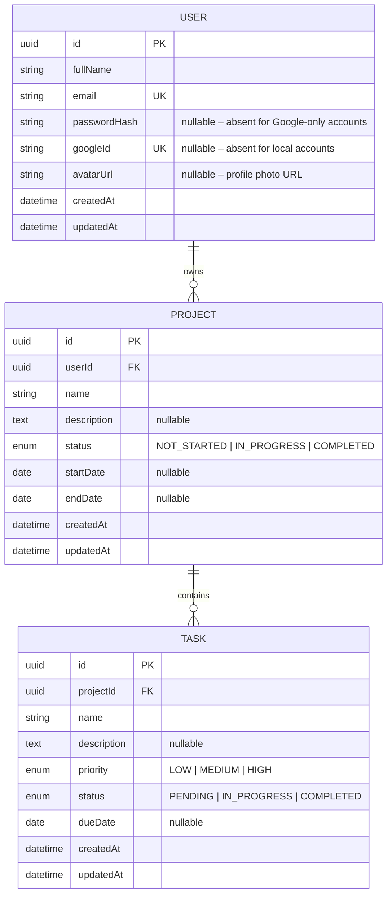

# ER Diagram

## Relationships

- **User → Project** : One-to-many. A user owns zero or more projects. Deleting a user cascades to all their projects and their tasks.
- **Project → Task** : One-to-many. A project contains zero or more tasks. Deleting a project cascades to all its tasks.

## Constraints

| Table | Constraint | Column(s) | Detail |
|-------|-----------|-----------|--------|
| User | PK | id | UUID |
| User | UNIQUE | email | — |
| User | UNIQUE | googleId | Nullable; absent for local-only accounts |
| Project | PK | id | UUID |
| Project | NOT NULL | name, status | — |
| Project | FK CASCADE | userId → User.id | Delete user → delete projects |
| Task | PK | id | UUID |
| Task | NOT NULL | name, priority, status | — |
| Task | FK CASCADE | projectId → Project.id | Delete project → delete tasks |

## Indexes

| Table | Index | Columns | Purpose |
|-------|-------|---------|---------|
| User | `User_email_key` | (email) | UNIQUE lookup on login / register |
| User | `User_googleId_key` | (googleId) | UNIQUE lookup on OAuth callback |
| Project | `Project_userId_idx` | (userId) | List all projects for a user |
| Project | `Project_status_idx` | (status) | Filter by status alone |
| Project | `Project_userId_status_idx` | **(userId, status)** | getAll with user + status filter *(composite)* |
| Task | `Task_projectId_idx` | (projectId) | List all tasks in a project |
| Task | `Task_status_idx` | (status) | Filter by status alone |
| Task | `Task_priority_idx` | (priority) | Filter by priority alone |
| Task | `Task_projectId_status_idx` | **(projectId, status)** | getAll with project + status filter *(composite)* |
| Task | `Task_projectId_priority_idx` | **(projectId, priority)** | getAll with project + priority filter *(composite)* |

## Auth Strategy

A `User` row may have:
- **Local only** — `passwordHash` set, `googleId` null
- **Google only** — `googleId` set, `passwordHash` null
- **Both** — `passwordHash` and `googleId` both set (linked account)

`passwordHash` and `googleId` cannot both be null simultaneously (enforced at the application layer in the register / OAuth callback handlers).
